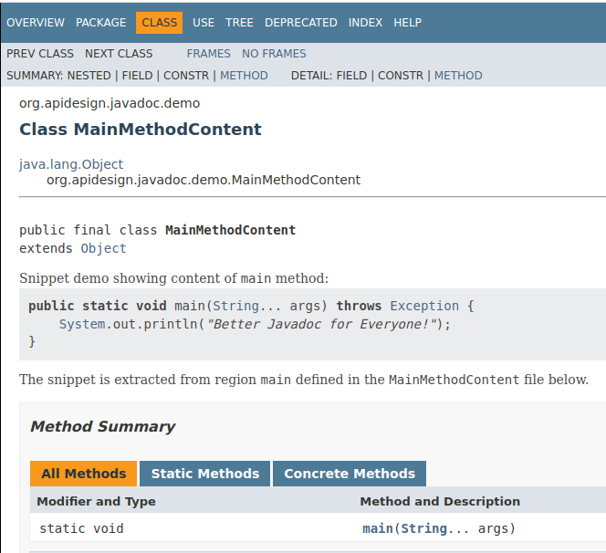
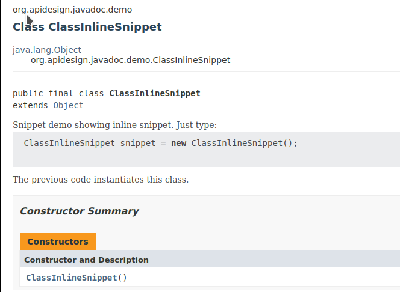

# Codesnippet Javadoc Doclet


Use code snippets in your Java API documentation - in **any JDK8+**. Fully **compatible** with
forthcoming [snippet support](https://openjdk.java.net/jeps/413) in **JDK18**. Say 
farewell to **broken** or **outdated samples** in your Javadoc! 
The *Codesnippet Doclet* helps you include real code snippets in the 
documentation ensuring they are **always compilable**. If you make the samples
part of your test suite, even ensuring they **execute properly**.

Use *org.apidesign.javadoc.codesnippet.Doclet* to **increase quality** of your Javadoc
now, even when compiling with older JDKs than JDK18.
The doclet uses similar infrastructure as was used when 
publishing [Practical API Design](http://practical.apidesign.org) 
and [20 API Paradoxes](http://buy.apidesign.org) books making 
sure **all code samples** were **correct**, **compilable** and 
printed with **pretty syntax** coloring.

This is the documentation for version 0.80 or newer. Read elsewhere about
using [older](docs/README-0.63.md) or the [oldest](docs/README-0.30.md) versions.

## How does it work?

The Codesnippet Doclet introduces new tag `{@snippet }` that allows you to reference real code snippets in your project. Identify the snippets in your code and then reference them from a Javadoc:

```java
/** Snippet demo showing content of {@code main} method:
 *
 * {@snippet file="org/apidesign/javadoc/demo/MainMethodContent.java" region="main"}
 *
 * The snippet is extracted from region {@code main} defined in the 
 * {@code MainMethodContent} class below.
 */
public final class MainMethodContent {
    // @start region="main"
    public static void main(String... args) throws Exception {
        System.out.println("Better Javadoc for Everyone!");
    }
    // @end region="main"

    private MainMethodContent() {
    }
}
```

The rendered Javadoc then looks like:



Identify important pieces of code and add line comment **@start: region="samplename"** before start of each snippet.
Put **@end region="samplename"** at the end of the code snippet. Then you can reference the snippet in Javadoc with
the **@snippet** tag.

An alternative way is to define *inline* snippets. Directly embed simple code
into the `@snippet` tag:

```java
/** Snippet demo showing inline snippet. Just type:
 *
 * {@snippet :
 * ClassInlineSnippet snippet = new ClassInlineSnippet();
 * }
 * 
 * The previous code instantiates this class.
 */
public final class ClassInlineSnippet {
}
```
and the snippet renders as



Having correct samples in Javadoc has never been easier!

## Use in a Maven Project

The bits of the [codesnippet-doclet](http://search.maven.org/#search%7Cga%7C1%7Ca%3A%22codesnippet-doclet%22)
are being uploaded to [Maven central](http://search.maven.org/#search%7Cga%7C1%7Ca%3A%22codesnippet-doclet%22).
Add the doclet to your Maven Javadoc plugin configuration
(as done [here](https://github.com/jtulach/codesnippet4javadoc/commit/16fd9cf7114d9ddc087cb3c0fcaec3d44acb2ed2#diff-74a104b8e241b27d093230d1c9a23dc4R16)):

```xml
<plugin>
   <groupId>org.apache.maven.plugins</groupId>
   <artifactId>maven-javadoc-plugin</artifactId>
   <version>2.10.3</version>
   <configuration>
     <doclet>org.apidesign.javadoc.codesnippet.Doclet</doclet>
     <docletArtifact>
       <groupId>org.apidesign.javadoc</groupId>
       <artifactId>codesnippet-doclet</artifactId>
       <version>0.80</version> <!-- or any newer version -->
     </docletArtifact>
     <!-- if you want to reference snippets from your test directory, also include -->
     <additionalparam>--snippet-path src/test/java</additionalparam>
    </configuration>
</plugin>
```

## Use in a Gradle Project

Add the doclet to your Gradle javadoc configuration

```groovy
configurations {
    snippetdoclet
}

dependencies {
    snippetdoclet group: 'org.apidesign.javadoc', name: 'codesnippet-doclet', version: '0.80'
}

javadoc {
    options.doclet = "org.apidesign.javadoc.codesnippet.Doclet"
    options.docletpath = configurations.snippetdoclet.files.asType(List)
    options.addStringOption "snippetpath", "src/test/java"
}
```

## Compatibility with JDK18

The Codesnippet doclet supports JDK8, JDK11, ..., JDK18. Originally the snippet
used slightly [different notation](docs/README-0.63.md) to indentify and refer
to code snippets. However, version 0.80 provides support for 
[standard JDK18 tags](https://openjdk.java.net/jeps/413) and one can choose
whether to support both syntaxes of just the [JDK18 one](https://openjdk.java.net/jeps/413).

Use `-snippetmode jep413` to support just the 
[JDK18 syntax](https://openjdk.java.net/jeps/413). This mode allows one to
use the Codesnippet doclet on older JDKs and rely on plain *javadoc* on
**JDK18+**. Everything the Codesnippet doclet supports (e.g. `@start` and `@end` tags
in sources and `@snippet` tag in Javadoc comments) is fully compatible with
**JDK18+** and renders similarly (Codesnippet is better as it automatically adds
syntax coloring and links to referenced classes) with both systems.

## Use with Command Line Javadoc Tool

Get the Codesnippet Doclet binary. Preferrably from the [Maven Central](http://search.maven.org/#search|ga|1|codesnippet-doclet). Invoke your Javadoc as usually plus add following parameters:

```bash
$ javadoc \
  -doclet org.apidesign.javadoc.codesnippet.Doclet \
  -docletpath path/to/downloaded/codesnippet-doclet.jar \
  --snippet-path src/test:src/sample # in case you want to pick the samples from other locations as well
```

## Embed Snippets in API files

You may prefer to include code snippets into the same files as your API to
improve life of people who browse the source in an IDE. In such case follow
the sample described in [EmbeddingSampleCode file](https://github.com/jtulach/codesnippet4javadoc/blob/515fdd141c8caed9d86afce859afb15a81054f7f/testing/src/main/java/org/apidesign/javadoc/testing/EmbeddingSampleCode.java) - e.g. add yet another
class to the end of your file, give it a special name (for example My**Snippet**)
and put code snippet there.

In addition to that you can reference your class as `{@link MySnippet}` if you
pass in additional parameter to specify format of your snippet classes:
```bash
$ javadoc \
  -snippetclasses .*Snippet.*
```
The doclet will then convert all links to classes that match such pattern
into appropriate code snippets.

You may want to exclude these sample classes from the final *JAR* file. The
easiest way to do so is to configure your JAR packager to ignore such files:
```xml
<plugin>
    <groupId>org.apache.maven.plugins</groupId>
    <artifactId>maven-jar-plugin</artifactId>
    <version>2.6</version>
    <configuration>
        <excludes>
            <exclude>**/*Snippet*.class</exclude>
        </excludes>
    </configuration>
</plugin>
```
Real life example is available [here](https://github.com/jtulach/codesnippet4javadoc/blob/515fdd141c8caed9d86afce859afb15a81054f7f/testing/pom.xml#L45).

## Maximum line length
By default Codesnippet will raise an error when the line length of the snippet exceeds 80 characters. This default
can be altered by specifying the maximum line length as parameter, like demonstrated below.
```bash
$ javadoc \
  -doclet org.apidesign.javadoc.codesnippet.Doclet \
  -docletpath path/to/downloaded/codesnippet-doclet.jar \
  -maxLineLength 120
```

## Verify @since tag

Quality of an API documentation can be increased if one requires that
*every API element has a @since tag*. To verify such statement
an automated tool is needed. This doclet is such tool. Just pass
`verifysincepresent` parameter
```bash
$ javadoc \
  -doclet org.apidesign.javadoc.codesnippet.Doclet \
  -docletpath path/to/downloaded/codesnippet-doclet.jar \
  -verifysincepresent
```
and warning will be printed for every element without the **@since** tag.

## Hide @Deprecated Classes

The code snippet doclet can, since version 0.11, exclude Javadoc elements annotated by some annotation from the Javadoc.
This is especially useful with `java.lang.Deprecated` annotation, by using:

```bash
$ javadoc \
  -doclet org.apidesign.javadoc.codesnippet.Doclet \
  -docletpath path/to/downloaded/codesnippet-doclet.jar \
  -hiddingannotation java.lang.Deprecated
```

one can eliminate deprecated fields and methods from the Javadoc and also hide classes and interfaces from the Javadoc
overview (however their individual HTML pages still remain in Javadoc for those who keep permanent links to them). One
can use the `-hiddingannotation` parameter with other annotations as well and even repeat the parameter multiple times
to hide multiple annotations at once.

## Linking types

The doclet searches existing `import` statements in the code snippet and tries to link the Java files in the package. 
When a matching type is found, the identifier is wrapped with `@link`. Note that the linking is best-effort only and when 
the type is not found, a warning message is logged `Tag @link: reference not found: <classname>`. 

You can suppress the warning by passing the parameter `-suppressMissingLinkWarnings` as shown below. This parameter will 
convert the warning to an informational message, so, you can continue to see the types that are missing links and not 
fail the build on warnings if `failOnWarnings` flag is set in your javadoc configuration.

```bash
$ javadoc \
  -doclet org.apidesign.javadoc.codesnippet.Doclet \
  -docletpath path/to/downloaded/codesnippet-doclet.jar \
  -suppressMissingLinkWarnings
```

## License

Feel free to use the Codesnippet Doclet binary to generate any public or private Javadoc. If you include the Codesnippet Doclet in your product or make modifications to it, please obey its *GPL 3.0* license.

## Projects Using Codesnippet Doclet

* [Truffle](https://github.com/oracle/graal/tree/master/truffle#readme) in its [Javadoc](http://www.graalvm.org/truffle/javadoc/)
* [Graal](https://github.com/oracle/graal/) in its [Graph I/O API](http://www.graalvm.org/graphio/javadoc/org/graalvm/graphio/package-summary.html)
* [Apache HTML/Java API](https://github.com/apache/incubator-netbeans-html4j#readme) in its [Javadoc](http://bits.netbeans.org/html+java/1.7/net/java/html/BrwsrCtx.html#execute-java.lang.Runnable-)
